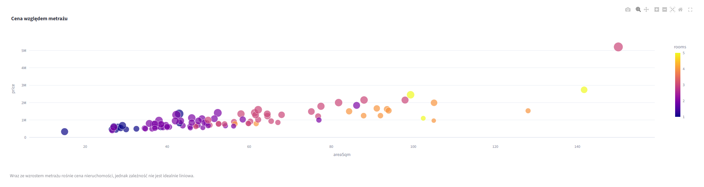
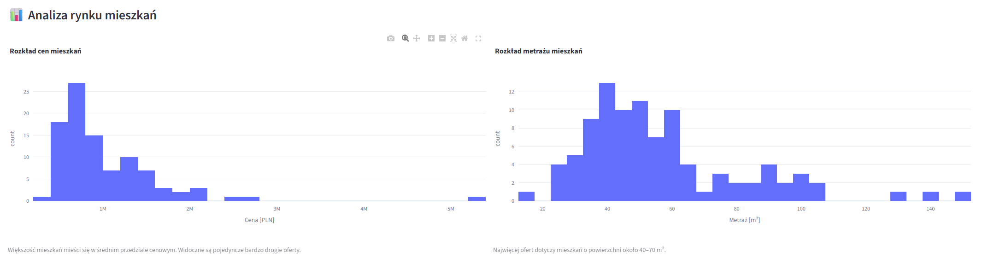
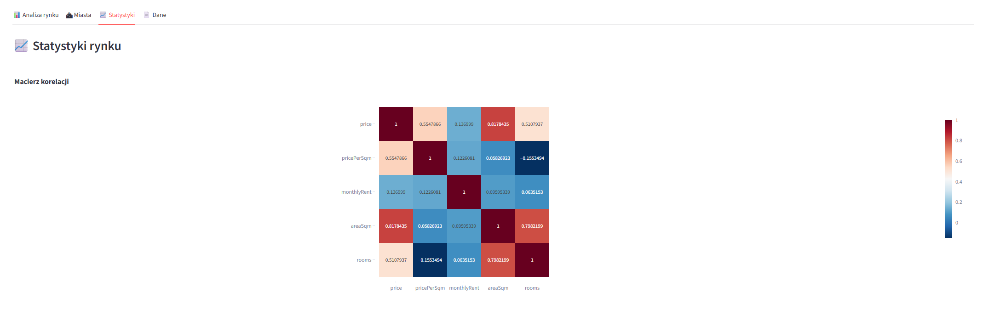

# 🏠 Analiza rynku mieszkań

## 📜 Opis projektu

Interaktywna aplikacja analityczna stworzona w **Python + Streamlit**, umożliwiająca analizę ofert sprzedaży mieszkań.

Projekt wykorzystuje prawdziwe dane o nieruchomościach i pozwala na ich filtrowanie, analizę oraz wizualizację za pomocą interaktywnych wykresów.

Aplikacja została przygotowana jako projekt zaliczeniowy z przedmiotu **Big Data**.

---

# ✨ Główne funkcjonalności

✅ Interaktywny dashboard

✅ Filtrowanie ofert według:

- ceny
- metrażu
- liczby pokoi
- typu nieruchomości
- wyszukiwania po tytule

✅ Podstawowe KPI:

- liczba ofert
- średnia cena
- średni metraż
- średnia cena za m²

✅ Analiza danych

- histogram cen mieszkań
- histogram metrażu
- wykres zależności ceny od metrażu
- analiza miast
- boxplot ceny za m²
- mapa ofert
- macierz korelacji
- trend cen
- TOP 10 najdroższych ofert
- statystyki opisowe

✅ Pobieranie przefiltrowanych danych do pliku CSV

---

# 🗂️ Struktura projektu

```
Analiza-Rynku-Mieszkan
│
├── app.py
├── data_loader.py
├── visualizations.py
├── requirements.txt
├── README.md
│
├── data
│   └── mieszkania.json
│
└── screenshots
    ├── dashboard.png
    ├── analiza.png
    └── statystyki.png
```

---

# 📊 Zastosowane technologie

- Streamlit
- Pandas
- NumPy
- Plotly

---

# 🖼️ Wygląd aplikacji

## Dashboard



---

## Analiza rynku



---

## Statystyki rynku



---

# 🚀 Uruchomienie projektu

### 1. Sklonuj repozytorium

```bash
git clone https://github.com/CyprianZTL/Analiza-Rynku-Mieszkan.git
```

### 2. Przejdź do katalogu

```bash
cd Analiza-Rynku-Mieszkan
```

### 3. Zainstaluj wymagane biblioteki

```bash
pip install -r requirements.txt
```

### 4. Uruchom aplikację

```bash
streamlit run app.py
```

---

# 🌐 Wersja online

Aplikacja dostępna pod adresem:

**👉 https://csfvkwczfcry9b8pdxhmkh.streamlit.app/**

---

# 📂 Źródło danych

Projekt wykorzystuje rzeczywiste dane dotyczące ofert sprzedaży mieszkań.

Dane zostały zapisane w pliku JSON znajdującym się w katalogu `data/`.

---

# 🎯 Najważniejsze elementy projektu

- ✔️ prawdziwe dane
- ✔️ czyszczenie danych
- ✔️ dashboard Streamlit
- ✔️ interaktywne filtry
- ✔️ analiza statystyczna
- ✔️ wizualizacje Plotly
- ✔️ eksport danych CSV
- ✔️ cache danych (`@st.cache_data`)

---

# 👤 Autor

**Cyprian**